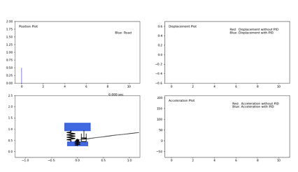

# Modeling Dynamic Car Suspension in Python


This repository contains a Python application for modeling, simulating, and visualizing the dynamic behavior of a car's quarter-suspension system. It features a graphical user interface (GUI) that allows users to compare the performance of a standard passive suspension system against an active suspension system controlled by a PID controller.

The simulation is based on a state-space model of a quarter-car system, and the results are displayed through a real-time animation and comparative plots.

## Features

*   **Graphical User Interface (GUI)**: An intuitive interface built with CustomTkinter for easy configuration and operation.
*   **Selectable Suspension Modes**: Choose from four pre-configured suspension modes with different stiffness (`ks`) and damping (`cs`) parameters:
    *   Comfort
    *   Normal
    *   Sport
    *   Track
*   **Customizable Road Profiles**:
    *   Select from various built-in road profiles (e.g., Hill, Gravel, Speed Bumps).
    *   Load custom road profiles from a CSV file.
*   **PID Controller**: Implements a PID controller for an active suspension system to improve ride comfort and stability.
*   **Comparative Visualization**:
    *   Real-time animation of the quarter-car model, showing the sprung and unsprung masses, spring, and damper.
    *   Dynamic plots comparing sprung mass displacement and acceleration for systems with and without PID control.

## Installation

1.  Clone the repository:
    ```bash
    git clone https://github.com/andreitoma59/Modeling-Dynamic-Supsension-Python.git
    cd Modeling-Dynamic-Supsension-Python
    ```

2.  Install the required Python libraries:
    ```bash
    pip install numpy control pandas customtkinter matplotlib
    ```

## How to Run

Execute the `main.py` script to launch the application:

```bash
python main.py
```

## Usage

1.  **Launch the application**.
2.  **Select Suspension Mode**: Choose one of the four radio buttons (Comfort, Normal, Sport, Track) to set the suspension's stiffness and damping characteristics.
3.  **Select Road Profile**:
    *   Use the dropdown menu to select a predefined road type.
    *   Alternatively, keep "None(Browse)" selected and click the "Browse CSV File" button to load your own road profile data. The CSV should contain a single column of numerical values representing the road's vertical displacement.
4.  **Start Simulation**: Click the "Start Simulation" button.
5.  **Observe Results**: A new window will open, displaying:
    *   An animation of the suspension model reacting to the road profile.
    *   Plots for road profile, sprung mass displacement, and sprung mass acceleration over time. The displacement and acceleration plots show a comparison between the standard system (red dashed line) and the PID-controlled system (blue solid line).

## Project Structure

*   `main.py`: The main entry point of the application. It contains the GUI layout, the state-space model of the suspension system, the PID controller logic, and orchestrates the simulation.
*   `visualizer.py`: Contains the `Visualizer` class which uses `matplotlib` to create and manage the real-time animation and data plots for the simulation results.